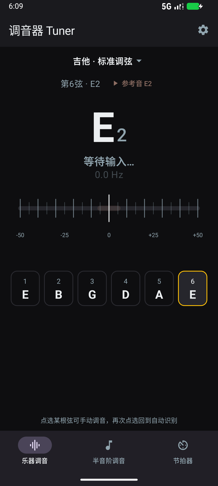
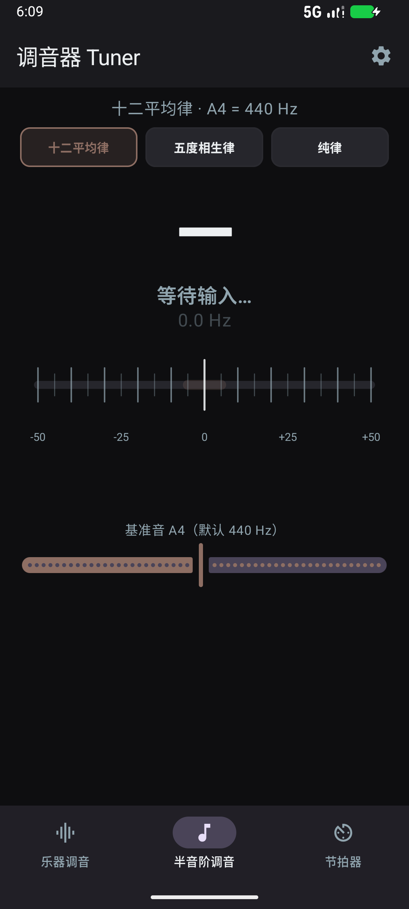
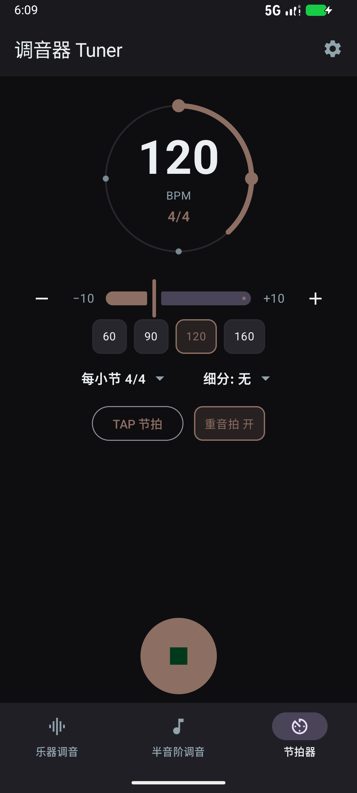

# Precision Tuner

<p align="center">
  
  
  
  
</p>

A precision all-in-one tuner for Android: instrument tuner, chromatic tuner with
historical temperaments, and a metronome — with AI-assisted pitch detection.

## Screenshots

| Instrument tuner | Chromatic tuner | Metronome |
| :-: | :-: | :-: |
|  |  |  |

## Features

- **Instrument tuner** — guitar, bass, ukulele, violin and more, with automatic
  string detection, manual string selection, and persistent custom tuning presets.
- **Chromatic tuner** — with three temperaments:
  - 十二平均律 (12-TET equal temperament)
  - 五度相生律 (Pythagorean tuning, pure fifths 3:2)
  - 纯律 (just intonation, 5-limit Ptolemaic)
  - Adjustable A4 reference (415–466 Hz) anchored across all temperaments.
- **AI-assisted detection** — hybrid pipeline: FFT coarse localization + pYIN-lite
  refinement, arbitrated against a bundled Tiny CREPE neural model (LiteRT) to
  reject subharmonic errors (e.g. E4 misread as A2 from string resonance). The
  neural model is built-time selectable: `tiny` (986 KB) / `small` (3.3 MB) /
  `full` (44.5 MB) — `small` is the default and measured sweet spot.
- **Metronome** — BPM presets, tap tempo, time signatures, subdivisions
  (eighths / triplets / sixteenths), downbeat accent, circular progress ring.
- **Visualizations** — spectrum and time-domain waveform views; two gauge
  styles (precision rail / dial) in a flat dark-light theme.

## Screenshots

| Instrument tuner | Chromatic tuner | Metronome |
| :-: | :-: | :-: |
|  |  |  |

## Build

The repo pins a writable Gradle home into the workspace (see `build.sh` for the
read-only-`~/.gradle` workaround) and uses Android Studio's bundled JDK:

```bash
./build.sh ./gradlew assembleDebug                     # normal build (DSP-only)
./build.sh ./gradlew -PtinyCrepeEnabled=true assembleDebug            # + CREPE (arm64)
./build.sh ./gradlew -PtinyCrepeEnabled=true -PcrepeModel=small assembleDebug
./build.sh ./gradlew testDebugUnitTest                 # unit tests
```

Install to a connected device:

```bash
./install-device.sh DEVICE_SERIAL --tiny-crepe
```

The CREPE experiment build is arm64-only; the normal build keeps all ABIs. See
`tools/crepe/README.md` for the reproducible model conversion pipeline
(weights are kept out of Git; hashes are recorded).

## Requirements

- Android 7.0+ (minSdk 24), 64-bit arm for the CREPE build.
- Microphone permission for tuning.

## License

MIT — see [LICENSE](LICENSE).

### Third-party notices

- **Tiny CREPE** (neural pitch model) — MIT, © 2018 Jong Wook Kim
  (`app/src/main/assets/licenses/CREPE_LICENSE.txt`); pretrained weights from
  [marl/crepe](https://github.com/marl/crepe), conversion recorded in
  `tools/crepe/convert_crepe.py`.
- **Kenney Interface Sounds** (in-tune cue) — CC0, [kenney.nl](https://kenney.nl)
  (`app/src/main/assets/licenses/KENNEY_INTERFACE_SOUNDS_LICENSE.txt`).
